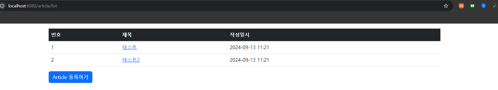
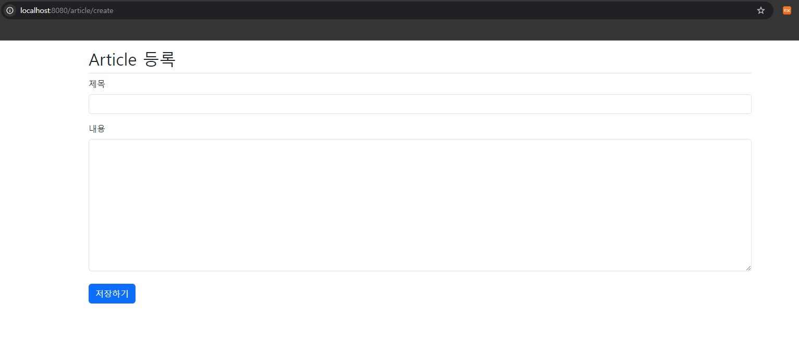
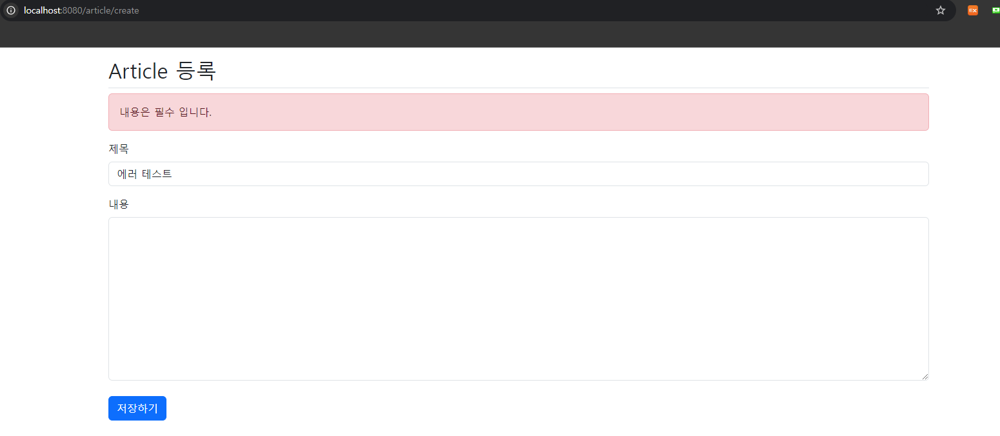
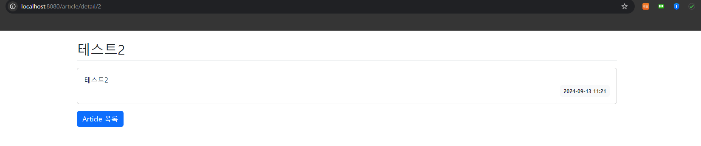

## 1차 요구사항 구현
- [x] 유저가 루트 url로 접속시에 게시글 리스트 페이지(http://주소:포트/article/list)가 나온다.
- [x] 리스트 페이지에서는 등록 버튼이 있고 버튼을 누르면 http://주소:포트/article/create 경로로 이동하고 등록 폼이 나온다.
- [x] 게시글 등록을 하면 http://주소:포트/article/create로 POST 요청을 보내어 DB에 해당 내용을 저장한다.
- [x] 게시글 등록이 되면 해당 게시글 리스트 페이지로 리다이렉트 된다. 페이지 URL 은 http://주소:포트/article/list 이다.
- [x] 리스트 페이지에서 해당 게시글을 클릭하면 상세페이지로 이동한다. 해당 경로는 http://주소:포트/article/detail/{id} 가 된다.
- [x] 게시글 상세 페이지에는 id에 맞는 게시글 데이터와 목록 버튼이 있다. 목록 버튼을 누르면 게시글 리스트 페이지로 이동하게 된다.

## 미비사항 or 막히는 부분
- html 작성하는데 너무 많은 시간이 소요된다

## UI/UX
- 게시글 리스트 페이지

- 게시글 등록 폼 페이지

- 게시글 상세 페이지

## MVC 패턴
- Model View Controller

- Model : Entity,Service,Repository
  데이터 및 로직 관리 처리
- View : Console
  사용자가 보는 페이지
- Controller : Controller
  View 와 Model 을 제어
- 사용자가 Controller 를 조작해 Model 에서 데이터를 가져오고 이 데이터를 View 를 제어해서 사용자에게 전달해준다.
- 각각 구성이 독립적으로 작동하여 유지 보수에 용이하다.
## 스프링에서 의존성 주입(DI) 방법 3가지 방법
- 생성자 주입 : 객체 생성시 의존성을 주입한다.
  복잡해질 가능성이 높다.

- 세터 주입 : Setter 메서드
  선택적 의존성 주입이 가능하다.

- 필드 주입 : 클래스 필드에 @Autowired 어노테이션 사용
  코드가 간결해진다. 하지만 테스트에 어려움이 있다.

## JPA의 장점과 단점
- Java Persistence API
- 객체 지향 프로그래밍의 방식으로 데이터베이스와의 상호작용을 처리할 수 있도록 설계된 표준 명세이다.
- 장점
    - 생산성 : 자바 코드만으로 데이터베이스 작업을 처리할 수 있다.
    - 유지보수 : 객체 모델을 이용하기 때문에 코드만 수정하면 된다.
    - 객체 지향적인 데이터 접근 : 데이터베이스와 상호작용하여 테이블의 행이 아닌 객체를 다르므로 직관적이다.
      -단점
    - 복잡한 설정 : 초기 설정이 다소 복잡할 수 있다.
    - 성능 문제 : 매서드 호출로 쿼리를 실행하는 건 내부적인 동작이 많아지는 것을 의미한다.

## HTTP GET 요청과 POST 요청의 차이
- GET 방식
    - 서버로 부터 정보를 요청할 때 사용한다.
    - 쿼리 스트링을 통해 데이터를 전송한다.
    - url 에 정보가 담겨지므로 보안에 취약하다.

- POST 방식
    - 정보를 생성/업데이트를 위해 서버에 데이터를 보내는 방식이다.
    - Body에 담아 데이터를 전송한다.
    - 보안에 좋다.